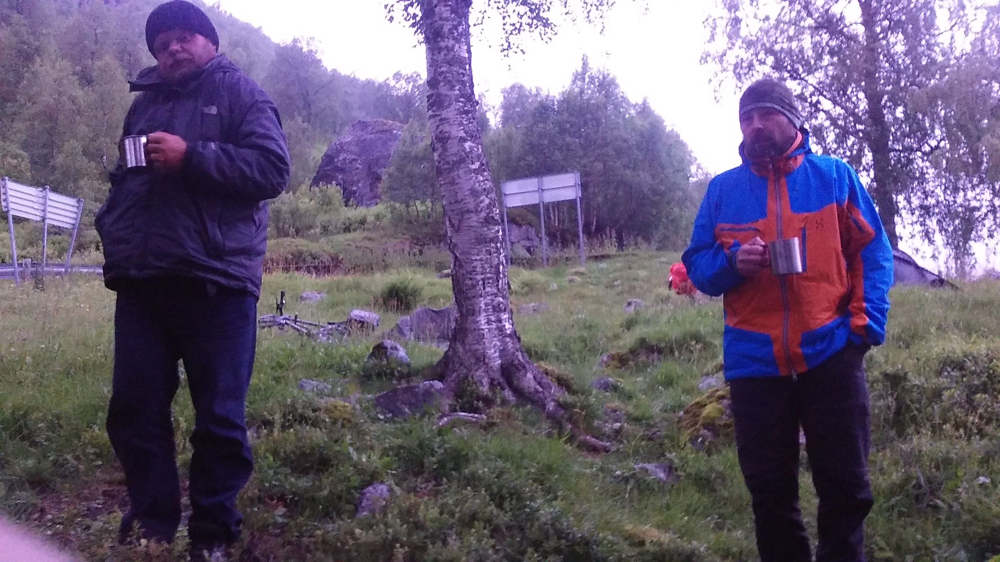

## Marsruut
Norra rattamatk alguse ja lõpuga Tallinnast, 2017-07-10 kuni 2017-07-21.
Auto ja laevaga Tallinn--Stockholm--Geilo ja tagasi 10-11. ja 20-21. juuli. 
Ratastega Geilo--Voss ring 12-19. juuli.
Rongiga Voss--Geilo.    

```{r setup, include=FALSE}
knitr::opts_chunk$set(echo = TRUE, message = FALSE)
library(tidyverse)
library(stringr)
library(xml2)
library(rgdal)
library(sp)
library(leaflet)
library(leaflet.extras) # fullscreen control button
```

## Träkkimine
Jalgrattamarsruuti träkkisin Suunto Ambit 2 kellaga. 
Aku tööaja pikendamiseks kasutasin 10 s salvestusintervalle ja 'OK' GPS täpsussetingut, mis peaks tagama ~50 tunnise patarei kasutusaja.    

Proovime selle marsruudi päevade kaupa kokku panna ja kaartile joonistada koos kõrgusprofiiliga.

## GPS rada kaartile
Kõige pealt laadime Suunto Movescount võrgulehelt alla .gpx _track_ failid.
GPX failidest impordime GPS andmed GIS formaati kasutades `readOGR` funktsiooni paketist `rgdal`.
Failinimedest võtame ka radade kuupäevad, et need hiljem iga päeva konkateneerida.
Alternatiivselt impordime GPX formadi ka xml formaadis R-i kasutades `read_xml` käsku paketist `xml2`.
XML formaadis GPX andmed formaadime pikka tabelisse kasutades spetsiaalselt selleks loodud skripti.


`readOGR` vajab importimiseks andmekihi spetsifitseerimist.
Failis olevaid andmekihte saab vaadata käsuga `ogrListLayers`.
__Rajajoonte__ joonistamiseks sobib kiht "tracks", __rajapunktid__ saab kätte kihist "track_points".
Samas, "track_points" sisaldab lisaks koordinaatidele ka näiteks kõrgusinfo andmeid.
Imporditud rajajooned on `SpatialLines` klassi objektid.

```{r import-gpx-files}
# List file names in data folder
gpx_files <- list.files("data/", full.names = TRUE)
# Extract date from filename and import files as xml
tracks <- data_frame(gpx_files) %>% 
  mutate(date = str_extract(gpx_files, "[0-9]{4}_[0-9]{2}_[0-9]{2}"),
         date = str_replace_all(date, "_", ""),
         xml = map(gpx_files, read_xml))
# List of available layers
ogrListLayers(tracks$gpx_files[1])
# Import files as shapefiles
tracks <- mutate(tracks, track = map(gpx_files, readOGR, layer = "tracks", verbose = FALSE))
tracks <- mutate(tracks, track_points = map(gpx_files, readOGR, layer = "track_points", verbose = FALSE))
```

Mõnel päeval salvestasin ma mitu träkki: näiteks enne lõunapausi ja peale lõunapausi.
Liidame need träkid päevakaupa kokku. 
Selleks kasutame `rbind.SpatialLines` funktsiooni paketist `sp`.
Originaalis on selle funktsiooni argumentideks üksikud `SpatialLines` objektid, mis siis funktsioonis kohe listiks konverteeritakse.
Selleks aga, et neid üksikuid träkke _tidyverse_ stiilis tabelis modifitseerida ja summeerida (kokku liita siis antud juhul), peaks `rbind.SpatialLines` saama hakkama ka sellisel juhul, kui argumendiks on objektide list.
Selleks lisasin `rbind.SpatialLines` (https://github.com/edzer/sp/blob/master/R/rbind.R) funktsiooni kolm rida, mis kontrollib kas listiks konverteeritud objekti pikkus on 1 (kui list pikkusega N konverteeritakse listiks, siis saadud objekti pikkus on 1). 
Kui on 1, siis funktsioon `unlist`-ib selle objekti mitte-rekursiivselt, nii et saame tagasi algse listi.
Vot nii lihtne...

```{r days-dist}
# Combine days tracks into lists for each date
dtrk <- select(tracks, date, track, track_points) %>% 
  group_by(date) %>% 
  do(days_trk = as.list(.$track),
     days_trk_points = as.list(.$track_points)) %>% 
  ungroup()
# Modified sp::rbind.SpatialLines function to use lists as input
source("lib/rbind_SpatialLines_list.R")
# Merge days distance using tidyverse approach
dtrk <- mutate(dtrk, days_trk = map(days_trk, rbind.SpatialLines.list),
               days_trk_points = map(days_trk_points, rbind.SpatialPointsDataFrame.list))
```

Legendi jaoks panen kokku igapäevased teekonna algus- ja lõpp-punktid.

```{r add-trips}
# Start and end points for days trips to be used in legend
trip <- data_frame(date = dtrk$date,
           trip = c("Geilo-Nedra Grøndalsvatne (Rallarvegen)",
                    "Nedra Grøndalsvatne-Voss-Dalavegen",
                    "Dalavegen-Stanghelle-Bergen (train)-Lyseklostervegen",
                    "Lyseklostervegen-Buavågen",
                    "Buavågen-Saudavegen",
                    "Saudavegen-Sauda-Håra",
                    "Håra-Odda-Utne",
                    "Kvanndal-Voss"))
# Merge with tracks using dates
dtrk <- left_join(dtrk, trip)
```

```{r photos, warning=FALSE}
photos <- list.files("photos/", full.names = TRUE)
exif_location <- function(path) {
  # Read GPS locaton using exiftool
  exif_cmd <- paste("exiftool -c '%.6f'", path, "| grep 'GPS Position'")  
  location <- system(exif_cmd, intern = TRUE, ignore.stderr = TRUE) # execute exiftool-command
  location <- stringr::str_extract_all(location, "[0-9]+\\.[0-9]+") %>%
    unlist %>% 
    vapply(as.numeric, FUN.VALUE =  double(1), USE.NAMES = FALSE) 
  
  if(length(location)!=2){
    warning("Location data not found!")
    location <- c(NA, NA)
  }
  
  names(location) <- c("lat","lon")
  location <- c(path = path, location)
  return(location)
}

photos_location <- lapply(photos, exif_location)
photos_location <- do.call(rbind, photos_location) %>% 
  as_tibble() %>% 
  filter(complete.cases(.)) %>% 
  mutate_at(c("lat","lon"), as.numeric)
photos_location <- mutate(photos_location, 
                          date = str_extract(path, "[0-9]{8}"),
                          popup = sprintf("
                                          <p>Foto: Taavi Päll</p>", path))
photos_location <- nest(photos_location, path, lat, lon, popup, .key = "popupdata")
dtrk <- left_join(dtrk, photos_location)
```


## Päevateekonnad {.tabset .tabset-fade}
Plotime _SpatialLines_ andmed kasutades paketti `leaflet`. 
Funktsioon on adapteeritud: http://mhermans.net/hiking-gpx-r-leaflet.html.

```{r plot-trip-fun}
# Use fa icon
icon_fa_camera <- makeAwesomeIcon(icon = 'camera', 
                           markerColor = 'red',
                           library='fa',
                           iconColor = 'black')
# Plotting function
plot_trip <- function(data, trip, popupdata) {
  # Thunderforest base url
  thunderforest_link_template <- "https://{s}.tile.thunderforest.com/%s/{z}/{x}/{y}.png?apikey=%s"
  
  m <- leaflet() %>%
    
    # Add tiles
    addTiles(sprintf(thunderforest_link_template, "landscape", Sys.getenv("THUNDERF_APIKEY")), group = "Topograafiline") %>%
    addTiles(sprintf(thunderforest_link_template, "cycle", Sys.getenv("THUNDERF_APIKEY")), group = "Rattateed") %>%
    addTiles(sprintf(thunderforest_link_template, "outdoors", Sys.getenv("THUNDERF_APIKEY")), group = "Matka- ja terviserajad") %>%
    addProviderTiles("Stamen.Terrain", group = "Pinnavormid", options = providerTileOptions(detectRetina = T)) %>%
    addProviderTiles("OpenStreetMap.Mapnik", group = "Sõiduteed", options = providerTileOptions(detectRetina = T)) %>%
    addProviderTiles("Esri.WorldImagery", group = "Satelliit", options = providerTileOptions(detectRetina = T)) %>%
    
    # Add legend
    addLegend(position = 'bottomright', opacity = 0.4, 
              colors = 'blue', 
              labels = trip,
              title = 'Norra 2017')
  
  if(!is.null(popupdata)){

    # Add photo markers
    m <- m %>% addAwesomeMarkers(lng = popupdata$lon,
                                 lat = popupdata$lat,
                                 popup = popupdata$popup,
                                 popupOptions = popupOptions(closeButton = FALSE, 
                                                             maxWidth = 500,
                                                             closeOnClick = TRUE),
                                 icon = icon_fa_camera,
                                 group = 'Fotod')
  }
  
  # Layers control
  m %>% addLayersControl(position = 'bottomright',
                         baseGroups = c("Topograafiline", 
                                        "Sõiduteed", 
                                        "Rattateed", 
                                        "Matka- ja terviserajad",  
                                        "Satelliit", 
                                        "Pinnavormid"),
                         overlayGroups = c("Rattamarsruut", "Fotod"),
                         options = layersControlOptions(collapsed = TRUE)) %>%
    
    # Add a fullscreen control button
    addFullscreenControl() %>% 
    
    addPolylines(data = data, color='blue', group = "Rattamarsruut") 
}
```

```{r plot-trips}
dtrk <- mutate(dtrk, trip_leaf = pmap(list(days_trk, trip, popupdata), plot_trip))
```

```{r day1, fig.cap="Esimene päev.", eval=FALSE}
dtrk$trip_leaf[[1]]
```

### K, 12. juuli

```{r day-1, echo=FALSE, fig.cap="Esimesel päeval sai kogemata hullu pandud ja kogu Rallarvägen ühe raksuga läbi sõidetud. Alguses sai suvise aasa servas õlut juua, hiljem tuli ratast läbi lume tassida."}
dtrk$trip_leaf[[1]]
```

### N, 13. juuli

```{r day-2, echo=FALSE, fig.cap="Myrdali ja Utne vahel tuli sõita üks peatus rongiga, läbi tunneli. Rongis on tunnelis sõites pileti ostmine problemaatiline, mistõttu saime lausa tasuta."}
dtrk$trip_leaf[[2]]
```

### R, 14. juuli

```{r day-3, echo=FALSE, fig.cap="Stanghelles oli plaan praamiga teisele kaldale sõita ja rattaga Bergenisse vändata, kuid selle ülesõidu oleks pidanud juba varem kokku leppima/tellima. Seega sõitsime rongiga otse Bergenisse. Ööbisime kloostri taga metsas, suht literaalselt."}
dtrk$trip_leaf[[3]]
```

### L, 15. juuli

```{r day-4, echo=FALSE, fig.cap="Päev algas ekslemise ja sadama otsimisega. Ööbima jäime vihma tõttu ühte pisikesse sadamasse, kõigi mugavustega sadamamajakesse."}
dtrk$trip_leaf[[4]]
```

### P, 16. juuli

```{r day-5, echo=FALSE, fig.cap="Hoogtöö päev. Sai sõidetud 100 km ja üle 1000 m ronitud. Unistasime õllest."}
dtrk$trip_leaf[[5]]
```

### E, 17. juuli

```{r day-6, echo=FALSE, fig.cap="Kõrgel on ilus - ronimise päev. Sai sõidetud pea poole vähem kui eelmisel päeval, kuid see eest rohkem ronida. Trackis on vahepeal katkestus, sest unustasin kella sisse lülitada, olid kõige magusamad ronimispalad."}
dtrk$trip_leaf[[6]]
```

### T, 18. juuli

```{r day-7, echo=FALSE, fig.cap="Allamäge. Päev algas küll korraliku ronimise ja 4+km pikkuse tunneliga, kuid hiljem oli ainult allamäge veeremine. Tundus, et läbisime Norra puuviljakasvatuspiirkonda - kõikjal olid mureli- ja pirniaiad."}
dtrk$trip_leaf[[7]]
```

### K, 19. juuli

```{r day-8, echo=FALSE, fig.cap="Tagasi Vossi rongi peale. Teepeal nägime paari turistilõksu ja peldikut, mis mõjus nagu pühamu."}
dtrk$trip_leaf[[8]]
```

## 

```{r tidy-gpx-function, comment=NA, include=FALSE}
source("lib/tidy_gpx.R")
tidy_gpx
```

```{r tidy-gpx, include=FALSE}
tracks <- mutate(tracks, gpx = map(xml, tidy_gpx))
```

```{r eval=FALSE}
dtrk$days_trk_points[[1]] %>% coordinates
dtrk$days_trk_points[[1]]$ele
dtrk$days_trk_points[[1]]$time
```

